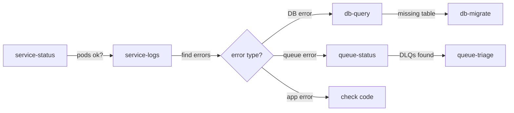
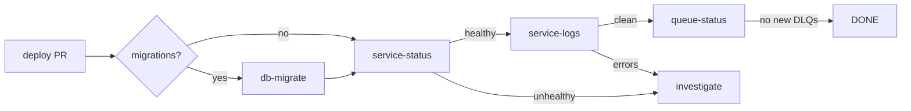
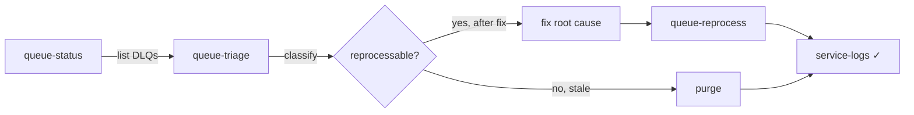

# Workflows

Real-world recipes for combining ops-suite skills. Each workflow describes a scenario, the skills involved, and the step-by-step flow.

---

## 1. Incident triage (something is broken)

**When:** Alerts fire, users report errors, or you notice something is off.

```
service-status → service-logs → queue-status → queue-triage → db-query
```



### Steps

1. `/ops-suite:service-status my-service dev`
   - Are pods running? Any restarts? CrashLoopBackOff?
   - If pods are down, fix that first (resource limits, image pull errors)

2. `/ops-suite:service-logs my-service dev`
   - What errors are in the logs? How frequent?
   - Classify: DB errors, queue errors, HTTP errors, app logic errors

3. If errors mention queues or messages:
   `/ops-suite:queue-status dev`
   - Any DLQs with messages? Which queues are affected?

4. For each DLQ with messages:
   `/ops-suite:queue-triage obligations-api:client:persisted.dead_letter dev`
   - Peek messages, classify failure mode, identify root cause

5. If errors mention database (missing table, column, connection):
   `/ops-suite:db-query dev`
   - Check if tables exist, verify migration status, test connectivity

### Example from real incident

```
service-logs found: "column o1.updated_at does not exist" + "relation assignment does not exist"
→ Root cause: migrations not applied after deploy
→ Fix: db-migrate applied 4 pending migrations
→ Verify: service-logs showed 0 errors post-migration
→ Follow-up: queue-triage found 390K messages in DLQs
→ Fix: queue-reprocess shoveled all messages back
```

---

## 2. Deploy and verify

**When:** A PR is merged and needs to be deployed to an environment.

```
deploy → db-migrate → service-status → service-logs → queue-status
```



### Steps

1. `/ops-suite:deploy 42 dev`
   - Verifies PR is merged, finds build artifact, deploys

2. `/ops-suite:db-migrate dev`
   - Lists pending migrations, applies them, verifies

3. `/ops-suite:service-status my-service dev`
   - Verify pods are running, no restarts, healthy

4. `/ops-suite:service-logs my-service dev`
   - Check last 5 minutes for errors — should be clean

5. `/ops-suite:queue-status dev`
   - Verify no new DLQ messages since deploy

### Checklist

- [ ] PR merged and build green
- [ ] Deployed to dev first
- [ ] Migrations applied (if any)
- [ ] Pods healthy, 0 restarts
- [ ] Logs clean (0 errors)
- [ ] No new DLQ messages
- [ ] Repeat for prod

---

## 3. DLQ cleanup

**When:** DLQs have accumulated messages and need to be triaged and reprocessed.

```
queue-status → queue-triage → (fix root cause) → queue-reprocess → service-logs
```



### Steps

1. `/ops-suite:queue-status dev`
   - Get overview: which DLQs have messages, how many

2. For each DLQ, starting with the most critical:
   `/ops-suite:queue-triage obligations-api:client:persisted.dead_letter dev`
   - Peek messages, check `x-first-death-reason`
   - Classify: schema mismatch, entity not found, service down, expired

3. Fix the root cause before reprocessing:
   - Missing table/column → `/ops-suite:db-migrate dev`
   - Service down → `/ops-suite:service-status my-service dev`
   - Schema mismatch → deploy fix first

4. `/ops-suite:queue-reprocess obligations-api:client:persisted.dead_letter dev`
   - Shovel (preferred for large volumes) or purge (for stale/irrecoverable messages)
   - Monitor progress, check for re-failures

5. `/ops-suite:service-logs my-service dev`
   - Verify 0 errors during reprocessing

### Decision tree: reprocess or purge?

| Situation | Action |
|-----------|--------|
| Root cause fixed, messages have valid payloads | Reprocess (shovel) |
| Messages are stale data (outdated by newer events) | Purge |
| Delete event for entity that was never created | Purge |
| Malformed payloads from producer bug | Purge (producer must resend) |
| External service was down, now recovered | Reprocess |
| Thousands of duplicate messages | Reprocess (idempotent consumers handle it) |

---

## 4. Database investigation

**When:** Need to check data state, verify migrations, or diagnose data-related errors.

```
port-forward → db-query → (optional: db-migrate)
```

### Steps

1. `/ops-suite:db-query "check latest assignments" dev`
   - Auto-establishes port-forward
   - Translates natural language to SQL
   - Shows query for confirmation before executing

2. Common queries:
   - "how many clients?" → `SELECT COUNT(*) FROM client`
   - "latest 20 assignments" → `SELECT * FROM assignment ORDER BY created_at DESC LIMIT 20`
   - "check migration status" → `SELECT * FROM mikro_orm_migrations ORDER BY executed_at DESC`
   - "table structure for obligation" → `SELECT column_name, data_type FROM information_schema.columns WHERE table_name = 'obligation'`

3. If the issue is missing tables or columns:
   `/ops-suite:db-migrate dev`

### Tips

- Queries are read-only by default (SELECT, EXPLAIN)
- Write operations (UPDATE, DELETE) always require confirmation
- Port-forward stays alive for follow-up queries
- Use LIMIT to prevent large result sets

---

## 5. Pre-deploy check

**When:** Before deploying to production, verify the environment is healthy.

```
service-status → service-logs → queue-status
```

### Steps

1. `/ops-suite:service-status my-service prod`
   - Baseline: are pods healthy? Any existing restarts?

2. `/ops-suite:service-logs my-service prod`
   - Any existing errors? What's the current error rate?

3. `/ops-suite:queue-status prod`
   - Any existing DLQ messages? How many consumers?

This gives you a baseline to compare against after deployment.

---

## 6. Cross-environment comparison

**When:** Something works in dev but not prod, or you need to verify parity.

### Steps

1. Check both environments:
   ```
   /ops-suite:service-status my-service dev
   /ops-suite:service-status my-service prod
   ```

2. Compare migrations:
   ```
   /ops-suite:db-query "SELECT name FROM mikro_orm_migrations ORDER BY name" dev
   /ops-suite:db-query "SELECT name FROM mikro_orm_migrations ORDER BY name" prod
   ```

3. Compare queues:
   ```
   /ops-suite:queue-status dev
   /ops-suite:queue-status prod
   ```

Look for: different migration states, different DLQ patterns, different pod versions.

---

## 7. Post-incident recovery

**When:** After fixing the root cause of an incident, clean up and verify.

```
db-migrate → service-status → service-logs → queue-triage → queue-reprocess → service-logs
```

### Steps

1. Apply the fix (deploy, migration, config change)
2. `/ops-suite:service-status` — verify pods are stable
3. `/ops-suite:service-logs` — verify errors stopped
4. `/ops-suite:queue-triage` — assess DLQ damage
5. `/ops-suite:queue-reprocess` — recover failed messages
6. `/ops-suite:service-logs` — final verification (0 errors during reprocessing)

---

## Quick reference: which skill for which symptom

| Symptom | Start with | Then |
|---------|-----------|------|
| "500 errors on endpoint" | service-logs | db-query if DB error |
| "pods keep restarting" | service-status | service-logs for crash reason |
| "messages not being processed" | queue-status | queue-triage |
| "data looks wrong" | db-query | service-logs for processing errors |
| "deploy broke something" | service-logs | db-migrate if schema error |
| "everything is slow" | service-status (CPU/mem) | service-logs for timeouts |
| "DLQ growing" | queue-triage | queue-reprocess after fix |
