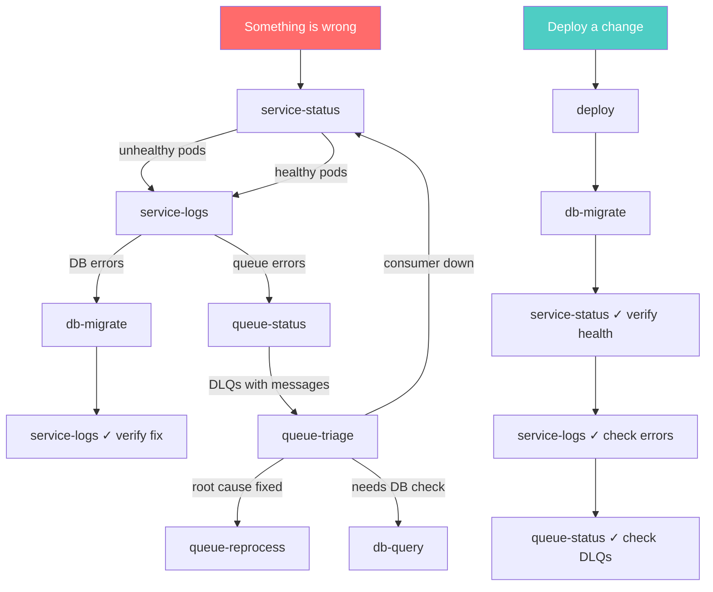

# ops-suite

Technology-agnostic infrastructure operations for Claude Code. Manage services, logs, databases, queues, deployments and migrations — all through natural language or slash commands.

## How it works

ops-suite is a Claude Code plugin with **9 skills** organized around operational concerns. Each skill is a markdown-driven workflow that the model follows step-by-step. Skills are **adapter-based**: the same skill works with Kubernetes, Docker Compose, or ECS — you just configure which one you use.

```
┌─────────────────────────────────────────────────────┐
│                    ops-suite                         │
│                                                     │
│  ┌─────────────┐  ┌─────────────┐  ┌────────────┐  │
│  │  Services   │  │  Databases  │  │   Queues   │  │
│  │             │  │             │  │            │  │
│  │ status      │  │ query       │  │ status     │  │
│  │ logs        │  │ migrate     │  │ triage     │  │
│  │ deploy      │  │ port-forward│  │ reprocess  │  │
│  └─────────────┘  └─────────────┘  └────────────┘  │
│                                                     │
│  ┌─────────────────────────────────────────────────┐ │
│  │              Adapters                           │ │
│  │  kubernetes · docker-compose · ecs              │ │
│  │  postgresql · mysql · mongodb                   │ │
│  │  rabbitmq · azure-service-bus · sqs · kafka     │ │
│  │  github-actions · gitlab-ci                     │ │
│  └─────────────────────────────────────────────────┘ │
│                                                     │
│  ┌──────────────────────┐                           │
│  │  config.yaml         │  One file. All envs.      │
│  └──────────────────────┘                           │
└─────────────────────────────────────────────────────┘
```

## Installation

1. **Clone or symlink** the plugin into your Claude Code plugins directory:

```bash
# If using workbench-dev
git clone https://github.com/aldorea/workbench-dev.git
```

2. **Add to your Claude Code settings** (`.claude/settings.json`):

```json
{
  "plugins": [
    "/path/to/workbench-dev/plugins/ops-suite"
  ]
}
```

3. **Create your config**:

```bash
cd /path/to/ops-suite
cp config.example.yaml config.yaml
# Edit config.yaml with your environments, namespaces, credentials, etc.
```

4. **Restart Claude Code** — the session-start hook will display available skills.

## Configuration

`config.yaml` defines your infrastructure:

```yaml
# What technologies you use
orchestrator: kubernetes        # kubernetes | docker-compose | ecs
message_broker: rabbitmq        # rabbitmq | azure-service-bus | sqs | kafka
database: postgresql            # postgresql | mysql | mongodb

# Your environments
environments:
  dev:
    context: "dev-cluster"
    namespaces:
      apps: "my-apps"
      infra: "shared-infra"
    services:
      broker:
        name: "rabbitmq"
        namespace: "shared-infra"    # override if different from infra
        vhost: "my_vhost"
        pod_pattern: "rabbitmq-*"
      database:
        name: "pgbouncer"
        namespace: "my-apps"         # override if different from infra
        port: 6432
        default_db: "my-service-dev"
  prod:
    # same structure...

# Deploy settings
deploy:
  ci_provider: github-actions
  migration_tool: mikro-orm
  migration_command: "npm run migrations:up"
  local_ports:
    dev: 16432
    prod: 16433
```

## Skills

| Skill | What it does | Invoke with |
|-------|-------------|-------------|
| **service-status** | Pod health, restarts, CPU/memory, deployment state | `/ops-suite:service-status [service] [env]` |
| **service-logs** | Error search, classification, frequency analysis | `/ops-suite:service-logs [service] [env]` |
| **db-query** | Read-only SQL queries with port-forward management | `/ops-suite:db-query [description] [env]` |
| **db-migrate** | List pending, apply, verify database migrations | `/ops-suite:db-migrate [env]` |
| **port-forward** | Establish local tunnels to cluster services | `/ops-suite:port-forward [service] [env]` |
| **queue-status** | List queues, consumers, DLQ counts | `/ops-suite:queue-status [env]` |
| **queue-triage** | Diagnose DLQ failures: peek messages, classify errors, find root cause | `/ops-suite:queue-triage [queue] [env]` |
| **queue-reprocess** | Move DLQ messages back via shovel, or purge | `/ops-suite:queue-reprocess [queue] [env]` |
| **deploy** | Deploy merged PRs: find artifact, trigger deploy, verify | `/ops-suite:deploy [PR-number] [env]` |

## Skill flow

Skills are designed to chain naturally. Here's how they connect:



## Project structure

```
ops-suite/
├── .claude-plugin/
│   └── plugin.json             # Plugin metadata
├── hooks/
│   ├── hooks.json              # SessionStart hook config
│   └── session-start.sh        # Builds skill catalog on session start
├── commands/                    # Slash command triggers (/ops-suite:xxx)
│   ├── service-status.md
│   ├── service-logs.md
│   ├── db-query.md
│   ├── db-migrate.md
│   ├── port-forward.md
│   ├── queue-status.md
│   ├── queue-triage.md
│   ├── queue-reprocess.md
│   └── deploy.md
├── skills/                      # Skill definitions (the actual logic)
│   ├── service-status/
│   │   ├── SKILL.md
│   │   └── adapters/
│   │       ├── kubernetes.md
│   │       ├── docker-compose.md
│   │       └── ecs.md
│   ├── service-logs/
│   │   ├── SKILL.md
│   │   └── adapters/...
│   ├── db-query/
│   │   ├── SKILL.md
│   │   ├── adapters/postgresql.md
│   │   ├── references/query-examples.md
│   │   └── scripts/query.js
│   ├── db-migrate/
│   │   ├── SKILL.md
│   │   ├── adapters/mikro-orm.md
│   │   └── references/commands.md
│   ├── queue-triage/
│   │   ├── SKILL.md
│   │   ├── adapters/rabbitmq.md
│   │   ├── references/known-patterns.md
│   │   └── scripts/analyze_messages.py
│   └── ...
├── docs/
│   ├── workflows.md             # Real-world workflow recipes
│   └── plans/                   # Improvement plans
├── config.example.yaml          # Template config
└── config.yaml                  # Your config (gitignored)
```

## Adding adapters

To support a new technology, create an adapter file in the relevant skill's `adapters/` directory. For example, to add MongoDB support for db-query:

1. Create `skills/db-query/adapters/mongodb.md`
2. Define the commands following the same structure as `postgresql.md`
3. Set `database: mongodb` in your `config.yaml`

The skill will automatically load your adapter.

## Roadmap (v2)

See [docs/plans/2026-03-18-ops-suite-v2-skill-chaining.md](docs/plans/2026-03-18-ops-suite-v2-skill-chaining.md) for the planned improvements:

- **Skill chaining** — skills invoke each other automatically (e.g., deploy → migrate → verify)
- **Environment safety gates** — dev auto-executes, prod always confirms
- **Pipeline skills** — `deploy-full` and `incident-triage` as composite workflows
- **Session state** — shared config, connections, and credentials across skills
- **Auto-invocation** — model detects intent and invokes the right skill without `/` commands
