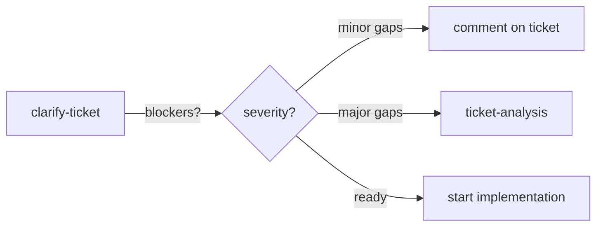
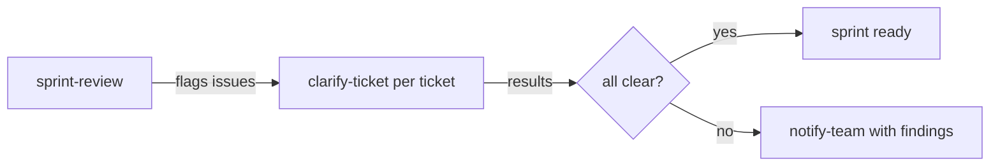
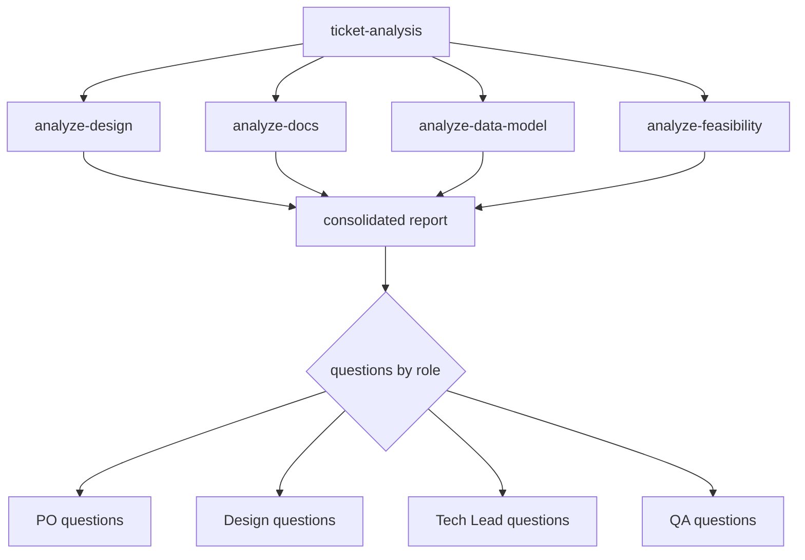
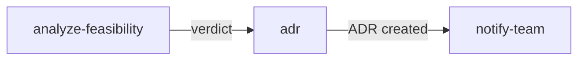
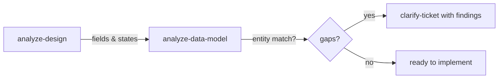

# Workflows

Real-world recipes for combining refinery skills. Each workflow describes a scenario, the skills involved, and the step-by-step flow.

---

## 1. New ticket arrives

**When:** A ticket lands in the backlog or sprint and you need a quick assessment.

```
clarify-ticket → (optional) ticket-analysis
```



### Steps

1. `/refinery:clarify-ticket PROJ-123`
   - Gets blockers (missing info that prevents implementation)
   - Gets nice-to-haves (missing but not blocking)
   - Gets structural issues (formatting, acceptance criteria)

2. If blockers are found, decide:
   - **Minor** (e.g., missing edge case) → Comment on ticket, proceed
   - **Major** (e.g., no acceptance criteria, design mismatch) → Run full analysis or send back to PO

3. If major blockers:
   `/refinery:ticket-analysis PROJ-123`
   - Launches 4 parallel agents for comprehensive cross-source analysis

### Tips

- `clarify-ticket` is fast (~30 seconds). Use it on every ticket.
- `ticket-analysis` is thorough (~2-3 minutes). Reserve for complex tickets.

---

## 2. Sprint planning

**When:** Sprint is being planned and you need to evaluate readiness of all tickets.

```
sprint-review → clarify-ticket (per flagged ticket) → notify-team
```



### Steps

1. `/refinery:sprint-review BOARD-1`
   - Runs 8 automated checks across all sprint tickets
   - Flags: oversized tickets, missing acceptance criteria, vague language, dependency issues, design gaps

2. For each flagged ticket:
   `/refinery:clarify-ticket PROJ-XXX`
   - Quick assessment of what's missing

3. Compile findings and share:
   `/refinery:notify-team #dev-team "sprint review findings"`
   - Drafts a structured message for Slack/Teams
   - You review before sending

### What the 8 checks cover

| Check | What it detects |
|-------|----------------|
| Story points | Oversized tickets (above threshold) |
| Acceptance criteria | Missing or vague criteria |
| Vague language | "should", "maybe", "TBD", "eventually" |
| Dependencies | Blocked or blocking tickets |
| Design coverage | Tickets with UI work but no linked design |
| Documentation | Referenced docs that don't exist |
| Bug ratio | Too many bugs in sprint (above threshold) |
| Systemic issues | Same problem across multiple tickets |

---

## 3. Deep ticket analysis

**When:** A complex ticket needs thorough investigation before committing to it.

```
ticket-analysis (orchestrates: analyze-design + analyze-docs + analyze-data-model + analyze-feasibility)
```



### Steps

1. `/refinery:ticket-analysis PROJ-123`
   - Reads the ticket from Jira/Linear
   - Launches 4 parallel agents:
     - **Design analysis**: Extracts fields, states, actions from Figma/Penpot
     - **Documentation search**: Finds business rules in Confluence/Notion
     - **Data model analysis**: Traces entities through the codebase
     - **Feasibility check**: Evaluates the technical approach

2. Review the consolidated report:
   - Cross-references: what's in the ticket vs design vs docs vs code
   - Questions grouped by role (PO, Design, Tech Lead, QA)
   - Scope assessment: is this bigger than estimated?

3. Follow up on gaps:
   - Design gaps → `/refinery:analyze-design <figma-url>` for details
   - Missing business rules → `/refinery:analyze-docs "business rule"`
   - Data model questions → `/refinery:analyze-data-model EntityName`

### When to use

- Before sprint commitment on any ticket estimated > 3 story points
- When a ticket touches multiple domains (DB + UI + external service)
- When the ticket description references a design or document that might be out of date

---

## 4. Architecture decisions

**When:** You need to document a technical decision, evaluate alternatives, or update an existing ADR.

```
analyze-feasibility → adr → notify-team
```



### Steps

1. Evaluate the options:
   `/refinery:analyze-feasibility "use event sourcing for audit trail"`
   - Checks dependencies, existing patterns, risks
   - Returns a verdict with alternatives

2. Document the decision:
   `/refinery:adr "audit trail strategy"`
   - Creates ADR in `docs/adr/` with standard template
   - Includes context, options, decision, consequences

3. Communicate:
   `/refinery:notify-team #architecture "new ADR: audit trail strategy"`

### ADR lifecycle

| Action | Command |
|--------|---------|
| Create new ADR | `/refinery:adr "topic"` |
| Update existing ADR | `/refinery:adr docs/adr/003-audit-trail.md` |
| Compact old ADRs | `/refinery:adr docs/adr/ --compact` |

---

## 5. Design handoff

**When:** A design is ready and you need to verify it matches the ticket and data model.

```
analyze-design → analyze-data-model → clarify-ticket
```



### Steps

1. `/refinery:analyze-design <figma-url>`
   - Extracts: data fields, table columns, actions, UI states, user flows
   - Returns structured output, not interpretation

2. `/refinery:analyze-data-model Client`
   - Traces the entity: fields, relationships, migrations, endpoints, consumers
   - Compares with what the design expects

3. Check alignment:
   - Fields in design but not in data model? → Migration needed
   - States in design but no status field? → Entity update needed
   - Actions in design but no endpoint? → API work needed

4. If gaps found:
   `/refinery:clarify-ticket PROJ-123`
   - Comments the gaps on the ticket

### What analyze-design extracts

| Category | Examples |
|----------|---------|
| Data fields | Input labels, form fields, display values |
| Table columns | Headers, sortable columns, filters |
| Actions | Buttons, links, form submissions |
| UI states | Empty, loading, error, success, disabled |
| User flows | Step sequences, navigation paths |

---

## 6. Bug reporting

**When:** You've found a defect and need to create a structured bug report.

```
(investigate) → create-bug → notify-team
```

### Steps

1. Investigate the issue first using ops-suite or code exploration
2. `/refinery:create-bug "Users see 500 error when creating assignments without a due date"`
   - Creates structured bug report with:
     - Description and reproduction steps
     - Evidence (logs, screenshots, data)
     - Root cause analysis
     - Suggested fix and impact assessment

3. Optionally notify:
   `/refinery:notify-team #dev-bugs "new bug: PROJ-456"`

---

## 7. Board-to-stories extraction

**When:** Product has created a Miro board with post-its/diagrams and you need to extract user stories.

```
board-to-stories → clarify-ticket (per story)
```

### Steps

1. `/refinery:board-to-stories <miro-url> --section "Sprint 14"`
   - Reads the board section
   - Extracts: defined stories, implicit stories (actions without explicit stories), blocked items
   - Identifies existing features that already cover some requirements

2. Review and refine the extracted stories

3. For each story, optionally:
   `/refinery:clarify-ticket` to validate completeness

---

## Quick reference: which skill for which situation

| Situation | Start with | Then |
|-----------|-----------|------|
| "Is this ticket ready?" | clarify-ticket | ticket-analysis if complex |
| "Is the sprint healthy?" | sprint-review | clarify-ticket per flag |
| "Does the design match the code?" | analyze-design | analyze-data-model |
| "What do the docs say about X?" | analyze-docs | — |
| "Can we build this approach?" | analyze-feasibility | adr if decision needed |
| "Found a bug" | create-bug | notify-team |
| "Need to document a decision" | adr | notify-team |
| "Board has stories to extract" | board-to-stories | clarify-ticket per story |
| "Need to tell the team" | notify-team | — |
